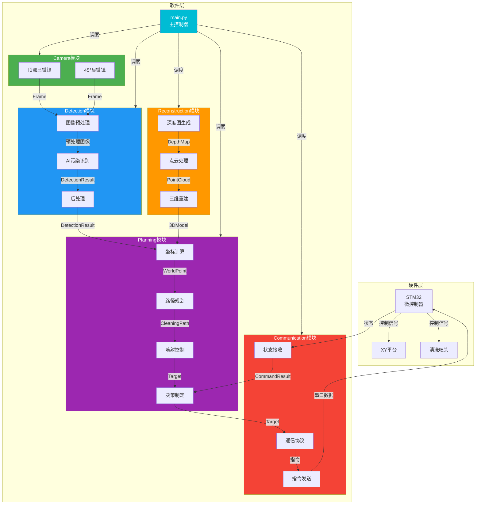
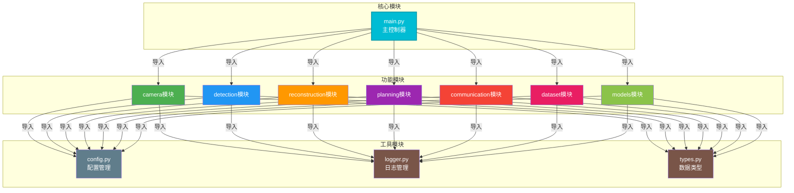

# MicroCleaningVision

基于双显微镜（顶部+45°）的智能微污染检测与清洗系统。

## 项目背景

本系统旨在实现微米级3D打印后处理中的智能污染检测与自动清洗功能。通过双显微镜采集图像，利用AI技术识别污染物，自动规划清洗路径并控制执行机构完成清洗任务。

## 系统流程

```
顶部显微镜采集图像
        ↓
45°显微镜采集图像
        ↓
图像预处理
        ↓
AI识别污染
        ↓
三维重建（后期）
        ↓
坐标计算
        ↓
发送STM32指令
        ↓
控制XY平台移动
        ↓
喷头喷射清洗
        ↓
返回检测
        ↓
判断是否继续清洗
```

## 项目架构

```
MicroCleaningVision/
├── main.py              # 主程序入口
├── config.py            # 配置管理模块
├── requirements.txt     # 依赖列表
├── README.md            # 项目说明文档
├── camera/              # 相机模块
│   ├── __init__.py
│   ├── camera.py        # 相机管理器
│   ├── calibration.py   # 相机校准
│   ├── stereo.py        # 双目标定与处理
│   └── light.py         # 光源控制
├── detection/           # 检测模块
│   ├── __init__.py
│   ├── detector.py      # 检测器
│   ├── preprocessing.py # 图像预处理
│   ├── tracker.py       # 目标追踪
│   └── postprocessing.py# 后处理
├── reconstruction/      # 三维重建模块（后期）
│   ├── __init__.py
│   ├── reconstructor.py # 重建器
│   ├── point_cloud.py   # 点云处理
│   └── depth_map.py     # 深度图生成
├── planning/            # 规划模块
│   ├── __init__.py
│   ├── planner.py       # 规划器
│   ├── coordinate_calculator.py # 坐标计算
│   ├── spray_controller.py     # 喷射控制
│   └── decision_maker.py       # 决策制定
├── communication/       # 通信模块
│   ├── __init__.py
│   ├── stm32_comm.py    # STM32通信
│   ├── protocol.py      # 通信协议
│   ├── error_handler.py # 错误处理
│   └── status_monitor.py # 状态监控
├── dataset/             # 数据集模块
│   ├── __init__.py
│   ├── dataset.py       # 数据集管理
│   ├── data_loader.py   # 数据加载
│   └── data_saver.py    # 数据保存
├── models/              # 模型模块
│   ├── __init__.py
│   ├── model_manager.py # 模型管理
│   ├── yolo_model.py    # YOLO模型封装
│   └── custom_model.py  # 自定义模型封装
├── utils/               # 工具模块
│   ├── __init__.py
│   ├── logger.py        # 日志管理
│   ├── image_utils.py   # 图像工具（预留）
│   ├── common_utils.py  # 通用工具（预留）
│   ├── types.py         # 统一数据类型定义
│   └── exceptions.py    # 自定义异常
├── docs/                # 文档目录
│   └── api_reference.md # API参考文档
└── test/                # 测试目录
    ├── test_camera.py   # 相机模块测试
    └── test_detection.py # 检测模块测试
```

## 模块说明

### camera模块

负责相机连接、图像采集和校准。

- **camera.py**: 管理顶部和45度两个相机的连接和采集
- **calibration.py**: 相机标定和参数管理
- **stereo.py**: 双目标定和立体视觉处理
- **light.py**: 光源亮度和模式控制

### detection模块

负责图像预处理、AI检测和后处理。

- **detector.py**: AI污染检测主入口
- **preprocessing.py**: 图像预处理（降噪、增强等）
- **tracker.py**: 目标追踪
- **postprocessing.py**: 检测结果后处理

### reconstruction模块（后期开发）

负责三维重建和深度估计。

- **reconstructor.py**: 三维重建主入口
- **point_cloud.py**: 点云数据处理
- **depth_map.py**: 深度图生成

### planning模块

负责路径规划、坐标计算和决策。

- **planner.py**: 整体规划协调
- **coordinate_calculator.py**: 像素坐标与世界坐标转换
- **spray_controller.py**: 喷射参数控制
- **decision_maker.py**: 清洗策略决策

### communication模块

负责与STM32微控制器的串口通信。

- **stm32_comm.py**: 串口通信主逻辑
- **protocol.py**: 通信协议定义
- **error_handler.py**: 通信错误处理
- **status_monitor.py**: 通信状态监控

### dataset模块

负责数据集管理和数据加载。

- **dataset.py**: 数据集组织和管理
- **data_loader.py**: 训练数据加载
- **data_saver.py**: 采集数据保存

### models模块

负责AI模型管理和推理。

- **model_manager.py**: 模型加载和切换
- **yolo_model.py**: YOLO模型封装
- **custom_model.py**: 自定义模型封装

### utils模块

提供通用工具函数和数据类型定义。

- **logger.py**: 日志记录和管理
- **image_utils.py**: 图像处理工具（预留）
- **common_utils.py**: 通用工具函数（预留）
- **types.py**: 统一数据类型定义（dataclass）
- **exceptions.py**: 自定义异常类

## 软件架构图

### 数据流架构



### 模块依赖图



**设计原则**: 除main.py外，其他模块之间**不互相依赖**，只依赖工具模块（config、logger、types），便于多人并行开发。

更多架构详情请参考 [docs/architecture.md](file:///d:/大创/opencv/MicroCleaningVision/docs/architecture.md)。

## 日志系统

### 日志等级设计

| 等级 | 使用场景 | 说明 |
|------|----------|------|
| DEBUG | 开发调试 | 仅在开发阶段使用，记录详细调试信息 |
| INFO | 关键流程 | 记录系统正常运行的关键节点 |
| WARNING | 异常但可运行 | 记录不影响系统运行的问题 |
| ERROR | 模块错误 | 记录模块运行错误，需要关注 |
| CRITICAL | 严重错误 | 记录导致系统无法工作的严重错误 |

### 日志文件结构

```
logs/
├── 2026-07-10/
│   ├── info.log        # INFO级别日志
│   ├── warning.log     # WARNING级别日志
│   └── error.log       # ERROR/CRITICAL级别日志
├── 2026-07-11/
│   ├── info.log
│   ├── warning.log
│   └── error.log
└── ...
```

### 日志格式

```
2026-07-10 10:20:30.123 | INFO     | Camera       | capture()            | EXP_001     | Image captured successfully
```

格式说明：`[时间] | [级别] | [模块] | [函数] | [实验编号] | [信息]`

### 日志策略

**需要记录的关键节点：**

- **系统**: 启动、关闭
- **Camera模块**: 连接成功/失败、图片采集成功、图片保存失败
- **AI模块**: 模型加载、检测完成、检测结果、置信度、识别失败
- **Calibration模块**: 标定成功、坐标转换结果
- **Communication模块**: 串口连接、发送命令、接收反馈
- **Planning模块**: 清洗开始、清洗结束、复检结果

**不需要记录：**

- 循环内部大量重复信息
- 普通变量变化
- 无意义计算过程

### 实验编号管理

系统自动生成实验编号（EXP_001, EXP_002...），便于后续：

- 实验数据分析
- 论文记录
- 大创材料整理

### 如何使用日志

**在模块中使用：**

```python
from utils.logger import logger

# 记录INFO级别日志
logger.info("连接成功", module="Camera", function="connect")

# 记录WARNING级别日志
logger.warning("曝光值超出范围", module="Camera", function="set_parameter")

# 记录ERROR级别日志
logger.error("采集失败", module="Camera", function="capture")

# 记录检测结果（专用方法）
logger.log_detection_result(count=5, confidence=0.92)

# 记录清洗结果（专用方法）
logger.log_cleaning_result(targets_cleaned=3, effectiveness=0.95)
```

**开发人员添加日志规范：**

1. **必须提供module和function参数**
2. **只记录关键节点**，不记录循环内重复信息
3. **使用合适的日志级别**，不要滥用DEBUG
4. **消息清晰简洁**，包含必要的上下文信息
5. **异常处理时使用exception方法**

### 异常处理

系统提供统一的异常类（定义在utils/exceptions.py）：

```python
from utils.exceptions import CameraError, DetectionError

try:
    # 代码
except CameraError as e:
    logger.error(str(e), module="Camera", function="capture")
except DetectionError as e:
    logger.error(str(e), module="Detection", function="detect")
```

## 设计原则

1. **高度解耦**: 每个模块独立，由main.py统一调度
2. **配置集中**: 所有参数统一放在config.py中管理
3. **日志统一**: 所有模块使用utils/logger.py记录日志
4. **数据类型统一**: 所有模块之间只能传递utils/types.py中定义的数据类
5. **便于协作**: 模块化设计方便多人并行开发
6. **易于扩展**: 预留接口便于后续升级AI模型和算法

## 统一数据类型

所有模块之间只能传递以下数据类（定义在utils/types.py中），不能直接传递tuple、dict等原生类型：

### 图像相关
- **Frame**: 图像帧类，包含图像数据、时间戳、相机信息等
- **CameraInfo**: 相机信息类，描述相机的基本信息和状态

### 检测相关
- **Detection**: 单个检测结果类，表示一个检测到的目标对象
- **DetectionResult**: 检测结果类，表示一次检测的完整结果

### 坐标与目标相关
- **WorldPoint**: 世界坐标点类，表示物理世界中的三维坐标
- **Target**: 目标类，表示一个需要清洗的目标位置
- **PathPoint**: 路径点类，表示路径规划中的一个点
- **CleaningPath**: 清洗路径类，表示一条完整的清洗路径

### 标定相关
- **CalibrationResult**: 标定结果类，表示相机标定的结果

### 系统状态相关
- **SystemStatus**: 系统状态类，表示系统各模块的状态
- **SystemState**: 系统全局状态类，表示整个系统的运行状态

### 命令与结果相关
- **CommandResult**: 命令执行结果类，表示发送给STM32的命令执行结果
- **CleaningResult**: 清洗结果类，表示一次清洗操作的结果

## 数据流向

```
CameraManager → Frame → Detector → DetectionResult → Planner → Target/CleaningPath → Communication → CommandResult
                                                                                              ↓
                                                                                     CleaningResult
```

所有模块之间通过以上数据类进行数据传递，确保接口清晰、类型安全。

## 安装依赖

```bash
pip install -r requirements.txt
```

## 运行方式

```bash
python main.py
```

## 配置说明

所有配置参数统一在[config.py](file:///d:/大创/opencv/MicroCleaningVision/config.py)中定义，**不在任何其他文件中出现魔法数字**。

### 配置类结构

```python
from config import Config
config = Config()

# 访问方式
config.camera.top_camera_id      # 顶部相机编号
config.communication.port        # 串口号
config.detection.confidence_threshold  # 置信度阈值
```

### 配置类详细说明

#### CameraConfig - 相机配置

管理工业相机和双目相机的所有参数。

| 参数 | 说明 | 默认值 |
|------|------|--------|
| top_camera_id | 顶部工业相机编号 | 0 |
| angle_camera_id | 45度工业相机编号 | 1 |
| stereo_left_camera_id | 双目左相机编号 | 2 |
| stereo_right_camera_id | 双目右相机编号 | 3 |
| image_width | 图像宽度（像素） | 1920 |
| image_height | 图像高度（像素） | 1080 |
| fps | 帧率（帧/秒） | 30 |
| exposure | 曝光时间（毫秒） | 100 |
| gain | 增益（1.0-10.0） | 1.0 |
| brightness | 亮度（0-255） | 128 |
| contrast | 对比度（0-255） | 128 |

#### CommunicationConfig - 通信配置

管理与STM32微控制器通信的所有参数。

| 参数 | 说明 | 默认值 |
|------|------|--------|
| port | 串口端口号 | COM3 |
| baud_rate | 波特率 | 115200 |
| data_bits | 数据位 | 8 |
| parity | 校验位 | none |
| stop_bits | 停止位 | 1 |
| timeout | 串口超时时间（秒） | 1.0 |
| command_timeout | 指令超时时间（秒） | 5.0 |
| retry_count | 指令重试次数 | 3 |

#### DetectionConfig - 检测配置

管理AI检测相关的所有参数。

| 参数 | 说明 | 默认值 |
|------|------|--------|
| confidence_threshold | 置信度阈值（0.0-1.0） | 0.5 |
| iou_threshold | IoU阈值（0.0-1.0） | 0.45 |
| nms_threshold | NMS阈值（0.0-1.0） | 0.45 |
| max_detections | 最大检测数量 | 100 |
| model_type | 模型类型 | yolo |
| input_size | 模型输入尺寸 | 640 |

#### ModelConfig - 模型配置

管理AI模型相关的所有参数。

| 参数 | 说明 | 默认值 |
|------|------|--------|
| yolo_model_path | YOLO模型文件路径 | models/yolov8n.pt |
| custom_model_path | 自定义模型文件路径 | models/custom.pt |
| custom_model_type | 自定义模型类型 | pytorch |
| use_gpu | 是否使用GPU | True |
| gpu_device_id | GPU设备ID | 0 |

#### PlanningConfig - 规划配置

管理路径规划和清洗控制的所有参数。

| 参数 | 说明 | 默认值 |
|------|------|--------|
| move_speed | 移动速度（毫米/秒） | 10.0 |
| acceleration | 加速度（毫米/秒²） | 5.0 |
| spray_duration | 默认喷射时间（毫秒） | 1000 |
| spray_pressure | 默认喷射压力（0.0-1.0） | 0.5 |
| min_spray_duration | 最小喷射时间（毫秒） | 100 |
| max_spray_duration | 最大喷射时间（毫秒） | 5000 |
| path_optimization | 是否启用路径优化 | True |

#### DatasetConfig - 数据集配置

管理数据集相关的所有参数。

| 参数 | 说明 | 默认值 |
|------|------|--------|
| dataset_path | 数据集根目录路径 | dataset/ |
| train_path | 训练集路径 | dataset/train/ |
| val_path | 验证集路径 | dataset/val/ |
| test_path | 测试集路径 | dataset/test/ |
| batch_size | 批量大小 | 8 |
| num_workers | 数据加载工作线程数 | 4 |

#### SaveConfig - 保存配置

管理数据保存相关的所有参数。

| 参数 | 说明 | 默认值 |
|------|------|--------|
| save_path | 保存根目录路径 | data/ |
| capture_path | 采集图像保存路径 | data/captures/ |
| detection_path | 检测结果保存路径 | data/detections/ |
| reconstruction_path | 重建结果保存路径 | data/reconstructions/ |
| log_path | 日志文件保存路径 | logs/ |
| save_format | 图像保存格式 | jpg |

#### LoggingConfig - 日志配置

管理日志记录相关的所有参数。

| 参数 | 说明 | 默认值 |
|------|------|--------|
| level | 日志级别 | INFO |
| file_path | 日志文件路径 | logs/ |
| log_file_name | 日志文件名 | app.log |
| max_size | 单个日志文件最大大小（MB） | 10 |
| backup_count | 日志文件备份数量 | 5 |

#### SystemConfig - 系统配置

管理系统级别的所有参数。

| 参数 | 说明 | 默认值 |
|------|------|--------|
| mode | 运行模式（auto/manual/test） | auto |
| max_cleaning_cycles | 最大清洗循环次数 | 5 |
| min_cleaning_effect | 最小清洗效果阈值 | 0.9 |
| enable_reconstruction | 是否启用三维重建 | False |
| enable_tracking | 是否启用目标追踪 | True |
| enable_visualization | 是否启用可视化 | True |

### 配置使用规范

1. **所有模块必须引用config.py**，不能在模块内部定义硬编码参数
2. **配置修改只需修改config.py**，无需修改任何业务代码
3. **配置类层级清晰**，便于维护和扩展
4. **支持默认值和自定义值**，修改配置只需更新默认值即可

## 开发建议

1. 按照模块顺序开发：camera → detection → planning → communication
2. 每个模块独立测试，确保接口稳定
3. 遵循Python代码规范（PEP 8）
4. 使用类型提示提高代码可读性
5. 添加详细的文档字符串

## 后续工作

- 实现三维重建功能
- 添加用户交互界面
- 优化检测算法
- 完善错误处理机制
- 添加更多测试用例

## 开发流程

### 标准开发流程

1. **拉取最新代码**:
   ```bash
   git checkout develop
   git pull origin develop
   ```

2. **创建功能分支**:
   ```bash
   git checkout -b feature/xxx-camera-module
   ```

3. **开发与提交**:
   ```bash
   git add .
   git commit -m "feat(camera): add camera manager class"
   ```

4. **推送分支**:
   ```bash
   git push origin feature/xxx-camera-module
   ```

5. **创建Pull Request**: 在GitHub上创建PR到develop分支

6. **代码审查**: 等待至少一位开发者审查通过

7. **合并代码**: 审查通过后合并到develop分支

### Git分支管理

| 分支类型 | 命名规范 | 用途 |
|----------|----------|------|
| main | `main` | 稳定版本，用于发布 |
| develop | `develop` | 开发主干，集成所有功能 |
| feature | `feature/xxx-description` | 新功能开发 |
| bugfix | `bugfix/xxx-description` | 修复bug |
| hotfix | `hotfix/xxx-description` | 紧急修复线上问题 |
| release | `release/v1.0.0` | 版本发布准备 |

### Pull Request流程

1. **PR标题**: `[类型] 简要描述`
   - 示例: `feat(camera): 添加相机管理模块`

2. **PR描述模板**:
   - **功能描述**: 实现了什么功能
   - **修改文件**: 修改了哪些文件
   - **测试情况**: 如何测试的
   - **相关Issue**: 关联的Issue编号

3. **审查要求**:
   - 至少需要1位开发者审查通过
   - 代码覆盖率达标
   - 符合编码规范

4. **合并规则**:
   - 使用Squash Merge方式合并
   - 合并前确保CI/CD通过
   - 删除已合并的分支

## 编码规范

### Commit规范

遵循Conventional Commits规范：

| 类型 | 说明 | 示例 |
|------|------|------|
| feat | 新功能 | `feat(camera): 添加相机采集功能` |
| fix | 修复bug | `fix(detection): 修复检测结果为空的问题` |
| docs | 文档更新 | `docs: 更新API文档` |
| style | 代码格式 | `style: 格式化代码` |
| refactor | 重构 | `refactor(utils): 重构日志模块` |
| test | 测试 | `test(camera): 添加相机模块测试` |
| chore | 构建/工具 | `chore: 更新依赖` |

**Commit信息格式**:
```
<类型>(<模块>): <简短描述>

<详细描述（可选）>

<关联Issue（可选）>
```

### 文件命名规范

| 文件类型 | 命名规范 | 示例 |
|----------|----------|------|
| Python文件 | 小写+下划线 | `camera_manager.py` |
| 测试文件 | `test_`前缀 | `test_camera.py` |
| 配置文件 | 小写+下划线 | `config.yaml` |
| 数据文件 | 小写+下划线 | `dataset_train.csv` |

### Python编码规范

遵循PEP 8规范：

1. **缩进**: 使用4个空格
2. **行宽**: 不超过120字符
3. **命名**:
   - 类名: `PascalCase`
   - 函数/方法名: `snake_case`
   - 变量名: `snake_case`
   - 常量: `UPPER_SNAKE_CASE`
4. **导入**:
   - 按标准库→第三方库→本地库顺序
   - 每组之间空一行
5. **文档字符串**: 使用Google风格
6. **类型提示**: 添加函数参数和返回值类型

### 模块命名规范

| 模块类型 | 命名规范 | 示例 |
|----------|----------|------|
| 包名 | 小写+下划线 | `camera_manager` |
| 模块名 | 小写+下划线 | `camera.py` |
| 类名 | `PascalCase` | `CameraManager` |
| 接口名 | `I`前缀+`PascalCase` | `ICamera` |
| 异常名 | `Error`后缀 | `CameraError` |

### 代码审查规范

1. **可读性**: 代码易于理解，变量命名清晰
2. **可维护性**: 避免重复代码，使用适当的设计模式
3. **性能**: 避免不必要的计算和内存占用
4. **安全性**: 避免潜在的安全漏洞
5. **测试**: 关键逻辑有对应的测试用例

## 协作规范

### 三人协作分工建议

| 开发者 | 负责模块 | 职责 |
|--------|----------|------|
| 开发者A | camera模块 | 相机采集、标定、光源控制 |
| 开发者B | detection模块 | AI检测、图像处理、模型管理 |
| 开发者C | planning模块 | 路径规划、坐标计算、STM32通信 |

### 每日同步

1. 每日站会同步进度
2. 遇到阻塞及时沟通
3. 定期代码审查

### 冲突解决

1. 定期拉取develop分支
2. 合并前先解决冲突
3. 复杂冲突需要团队讨论

## 许可证

MIT License
