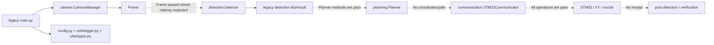

# 系统架构说明 v0：每一层只做自己的事

## 用一句话看懂当前架构

系统不是一条“检测到污渍就喷”的直线，而是一串有交接、有否决权、有复查的实验步骤。前一层只能提供事实或建议；能让物理世界改变的权限，必须在安全审批后才交给确定性控制器。

## 目的与迁移边界

遗留文件夹已因不完整、不安全且误导能力边界而清理；Git 历史保留其考古记录。新的 `microcleaning/` 包是一个小型、无依赖的 MCL 组合层，确立了未来真实适配器必须满足的契约。详见 `docs/11_旧版文件清理记录.md`。

## 历史遗留依赖与数据流审计

已删除的遗留设计曾意图走以下路径；虚线边从来不是可用能力，因为接收方是桩，或调用方/接收方契约不一致。

旧 `main.py` 还曾在动作后以错误参数数量调用检测器。因此它已替换为只运行 Mock 的安全入口，而不是被修补成硬件路径。

## 当前实现状态：哪些真的能运行，哪些只是演练

| 层 | 当前代码 | 现在究竟代表什么 |
|---|---|---|
| 契约 | `microcleaning/contracts.py` | 已测试的软件契约 |
| 感知 | `microcleaning/app/mock_mcl.py` 中的 `MockCamera` | 仅模拟；不打开设备 |
| 状态 | `StateEstimate` | 仅模拟数据 |
| 决策 | `RuleDecision` | 固定有界提案，非学习策略 |
| 安全 | `MockSafetyGovernor` | 已测试的软件规则；非经验证的物理联锁 |
| 执行 | `MockController` | 仅模拟；无串口、泵、电机或喷嘴访问 |
| 验证 | `SimpleVerifier` | 仅合成残差；非物理洁净度/损伤指标 |
| 记忆 | JSON `Episode` 由 `write_episode` 保存 | 仅软件可追溯性 |

## 迁移规则：每次只替换一块，不要整机重写

例如，相机准备好后，只把 `MockCamera` 换成“真实顶视图相机适配器”，其余层不动；这样出现问题才能定位。绝不以 AI 模型替代安全治理器；绝不暴露接受自由文本的控制器方法。真实控制器适配器必须接受有效的 `ActionRequest` *和* 当前 `SafetyDecision(ALLOW)`，并基于实际设备反馈返回 `ExecutionReceipt`。
