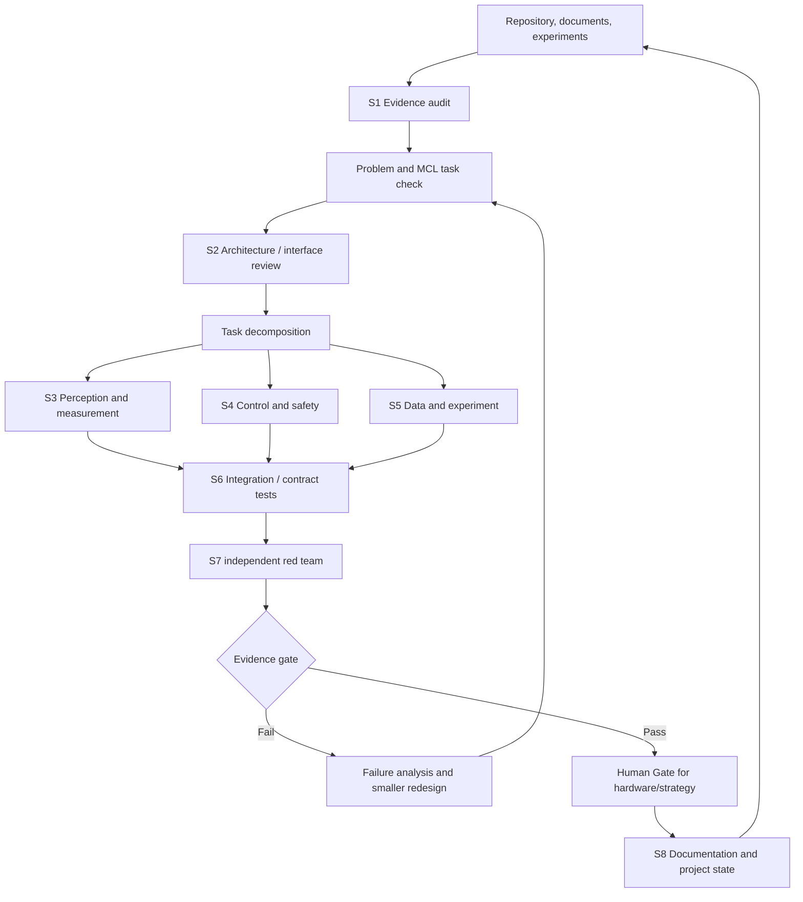

# 研发协作流程图：让工作可追溯，不让 Agent 越权

## 先分清四个词

- **流程图（Graph）**：像实验流程卡，规定信息从哪里来、失败后回到哪里，不负责“思考”。
- **Agent / 子任务角色**：在一个有限问题上分析、实现或挑错的人/工具节点。
- **Skill（技能卡）**：以后还能重复照着做的操作步骤，例如相机标定、Git 协作、失败复盘。
- **人工关卡（Human Gate）**：涉及真实设备、风险、价值取舍时，必须由真实成员签字决定。

因此，Agent 可以帮忙审代码、设计实验和找漏洞，却永远不是喷头或电机的授权人。

| 节点 | 可做 | 不可做 |
|---|---|---|
| S1 证据审计员 | 确立事实/证据等级 | 从代码推断硬件成功 |
| S2 架构师 | 定义最小接口 | 为臆想的未来扩充文件夹 |
| S3 感知 | 测量图像/标定/验证 | 指挥硬件 |
| S4 控制与安全 | 定义确定性安全/控制器边界 | 让模型输出绕过安全 |
| S5 数据与实验 | 协议、回合、失败/A-B 证据 | 将生成的标签视为真值 |
| S6 集成 | 破坏契约与失败路径 | 为让测试好看而添加功能 |
| S7 红队 | 独立攻击安全/证据 | 批准自己的实现 |
| S8 文档 | 保留共享真相/培训 | 把计划工作当作既成事实 |

人工关卡掌管真实硬件使能、有风险的实验条件、战略范围、对外发布以及对不确定证据的解释。
