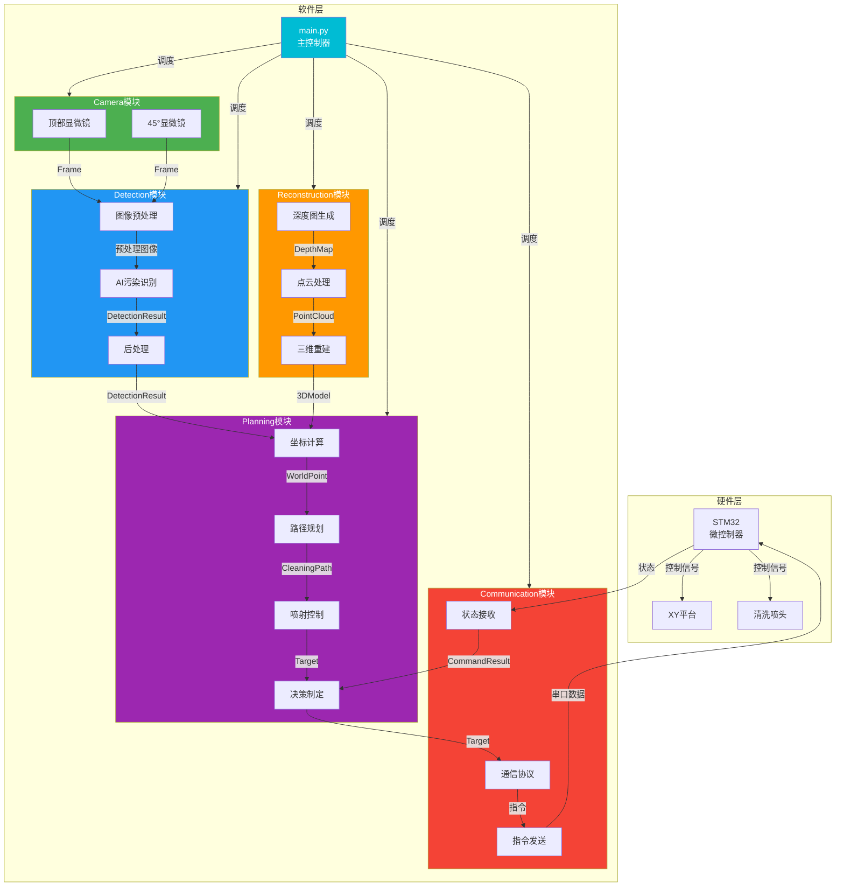
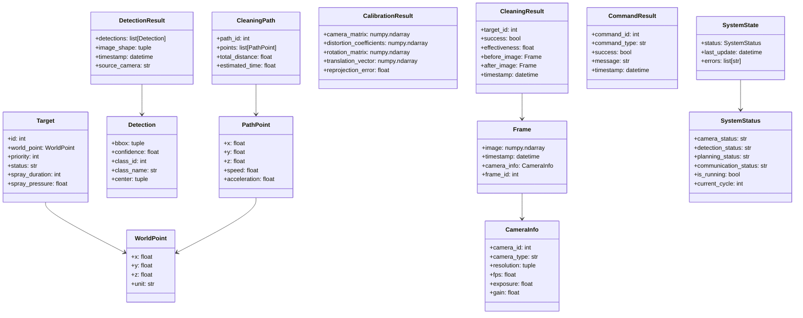
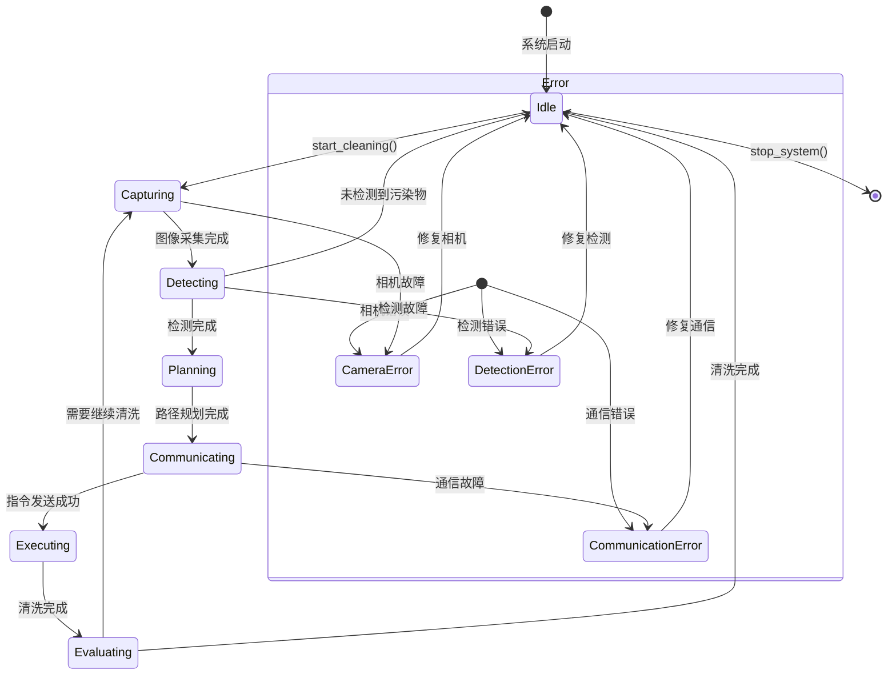

# MicroCleaningVision 架构文档

## 1. 软件架构图（数据流）

## 2. 模块依赖图

```mermaid
graph TD
    subgraph 核心模块
        Main["main.py\n主控制器"]
    end
    
    subgraph 功能模块
        Camera["camera模块"]
        Detection["detection模块"]
        Reconstruction["reconstruction模块"]
        Planning["planning模块"]
        Communication["communication模块"]
        Dataset["dataset模块"]
        Models["models模块"]
    end
    
    subgraph 工具模块
        Utils["utils模块"]
        Config["config.py\n配置管理"]
        Logger["logger.py\n日志管理"]
        Types["types.py\n数据类型"]
    end
    
    Main -->|导入| Camera
    Main -->|导入| Detection
    Main -->|导入| Reconstruction
    Main -->|导入| Planning
    Main -->|导入| Communication
    Main -->|导入| Dataset
    Main -->|导入| Models
    Main -->|导入| Utils
    Main -->|导入| Config
    
    Camera -->|导入| Config
    Camera -->|导入| Logger
    Camera -->|导入| Types
    
    Detection -->|导入| Config
    Detection -->|导入| Logger
    Detection -->|导入| Types
    
    Reconstruction -->|导入| Config
    Reconstruction -->|导入| Logger
    Reconstruction -->|导入| Types
    
    Planning -->|导入| Config
    Planning -->|导入| Logger
    Planning -->|导入| Types
    
    Communication -->|导入| Config
    Communication -->|导入| Logger
    Communication -->|导入| Types
    
    Dataset -->|导入| Config
    Dataset -->|导入| Logger
    Dataset -->|导入| Types
    
    Models -->|导入| Config
    Models -->|导入| Logger
    Models -->|导入| Types
    
    Utils -->|导入| Config
    
    style Main fill:#00BCD4,color:#fff,stroke:#0097A7,stroke-width:2px
    style Utils fill:#795548,color:#fff
    style Config fill:#607D8B,color:#fff
    style Logger fill:#795548,color:#fff
    style Types fill:#795548,color:#fff
    
    style Camera fill:#4CAF50,color:#fff
    style Detection fill:#2196F3,color:#fff
    style Reconstruction fill:#FF9800,color:#fff
    style Planning fill:#9C27B0,color:#fff
    style Communication fill:#F44336,color:#fff
    style Dataset fill:#E91E63,color:#fff
    style Models fill:#8BC34A,color:#fff
```

## 3. 数据类依赖关系

## 4. 系统状态机

## 5. 模块职责矩阵

| 模块 | 核心职责 | 输入数据 | 输出数据 | 关键类 |
|------|----------|----------|----------|--------|
| camera | 图像采集与控制 | - | Frame | CameraManager |
| detection | AI污染检测 | Frame | DetectionResult | Detector |
| reconstruction | 三维重建 | Frame | PointCloud/DepthMap | ReconstructionManager |
| planning | 路径规划与决策 | DetectionResult/PointCloud | Target/CleaningPath | Planner |
| communication | STM32通信 | Target/CleaningPath | CommandResult | STM32Communicator |
| dataset | 数据集管理 | - | Dataset | DatasetManager |
| models | 模型管理 | - | Model | ModelManager |
| utils | 工具函数 | - | - | Logger/ConfigParser |

## 6. 设计原则总结

### 高内聚低耦合
- 每个模块只负责一个核心功能
- 模块之间通过统一数据类型交互
- 避免模块间的直接依赖

### 单一职责
- Camera: 只负责图像采集
- Detection: 只负责污染检测
- Planning: 只负责路径规划和决策
- Communication: 只负责与STM32通信

### 统一接口
- 所有模块通过config.py获取配置
- 所有模块使用logger.py记录日志
- 所有模块之间传递统一的数据类

### 可扩展性
- 预留三维重建接口
- 支持多种AI模型切换
- 支持多种通信协议扩展

### 便于协作
- 模块独立，多人可并行开发
- 统一编码规范和文档标准
- 清晰的模块边界和数据流
