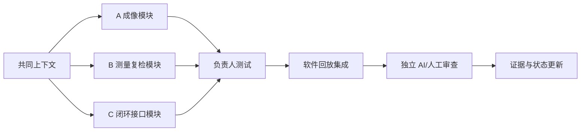

# 研发协作与 AI 工作流

## 共享上下文不是“大家改同一个文件”

全员共同读取 `AGENTS.md`、`project_state.yaml` 和 `contracts.py`；日常只修改自己的业务文件。共享接口变化通过 PR 提案和下游评审完成。



## 每张任务卡的工作顺序

1. 用 `$visual-closed-loop-task` 让 AI 读取共同上下文。
2. 给 AI 当前任务卡、负责人文件和禁止修改的文件。
3. 先写失败条件和测试，再写最小实现。
4. 运行负责人测试、视觉闭环测试、旧 Mock 回归。
5. 由下游成员审接口含义；再让独立 AI 做红队审查。
6. 合并后更新 `project_state.yaml`，只写测试或数据实际证明的事实。

## Multi-Agent 当前怎么实现

当前不在产品运行时加入 Agent 框架。Multi-Agent 是研发分工：一个 AI 帮负责人实现，一个独立 AI 只做接口/证据攻击，最终由真实成员决定是否接受。Agent 不能批准自己的改动，也不能连接硬件。

## AI 提示词模板

```text
使用 $visual-closed-loop-task。
我的角色是成员 A/B/C，本次任务卡是……
只允许修改……；以下共享文件只读……
输入样本/失败样本是……
验收测试是……
先解释数据流和失败模式，再实施；完成后区分框架、模拟证据和真实证据。
```

