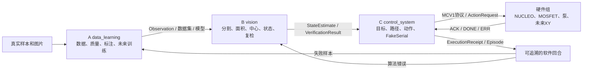

# 系统架构说明：三条软件主线，一个真实硬件出口

## 1. 项目到底在处理什么

系统面对的是一个表面状态变化问题：先拍摄，再判断污染，再提出处理位置，最后重新拍摄确认状态有没有改变。

```text
动作前图像 → 污染测量 → 目标与动作 → 模拟/真实执行 → 动作后图像 → 结果比较
```

当前完成软件和合成回放证据，并实现了通用USB相机适配器的FakeVideoCapture测试。U500实机抓帧、毫米标定、STM32、运动平台和喷洗仍没有被当前仓库证明。

## 2. 为什么从九个小目录收敛成三个业务模块

旧目录按技术名词拆成 `perception/state/decision/safety/execution/data/app`。逻辑上没有错，但三名新手会遇到两个问题：一个人要跨多个顶层目录工作；多个目录里只有一两个文件，看起来像大量空壳。

现在按“一个人最终交付什么”组织：

```text
microcleaning/
├── contracts.py
├── ports.py
├── data_learning/       A：生产可信数据和未来模型
├── vision/              B：从图片得到污染测量
└── control_system/      C：把测量变成目标、动作和控制仿真
```

目录更少不代表责任消失。安全审批、回执和复检仍保留，只是归入真正使用它们的业务模块。

## 3. 三个软件模块与硬件组的数据流



这里的回箭头很重要：C不是替A/B做工作，而是把系统失败准确退回文件所有者。

## 4. A 模块：`data_learning/`

当前真实存在：

| 文件 | 当前作用 | 证据边界 |
|---|---|---|
| `image_quality.py` | 解码图片，计算清晰度和亮度原始指标 | 已用程序生成图片测试；真实相机阈值未验证 |
| `replay_camera.py` | 把登记图片转换为 `Observation` | 不打开真实相机 |
| `inspect_images.py` | 批量检查图片并输出质量信息 | 报告不是正式数据集 |

未来只有在任务实际开始时才增加采集、标注转换、数据划分和训练文件；不预建空目录。

## 5. B 模块：`vision/`

当前真实存在：

| 文件 | 当前作用 | 证据边界 |
|---|---|---|
| `contamination.py` | 定义污染测量结果 | 尚未接入真实 HSV 分割 |
| `state_estimator.py` | 把观测和测量组合为任务状态 | 无标定时不会产生毫米位置 |
| `verification.py` | 比较前后面积并决定停止/重试/人工 | 当前输入仍是回放数值，未验证真实配准 |

B只能描述“看到了什么”和“测量有多可信”，不能直接打开串口或调用控制器。

## 6. C 模块：`control_system/`

当前真实存在：

| 文件 | 当前作用 | 证据边界 |
|---|---|---|
| `fixed_rule.py` | 为一个已定位目标提出固定动作申请 | 参数只用于软件回放 |
| `governor.py` | 保留不可绕过的最低动作边界 | ALLOW 只允许 FakeSerial |
| `fake_serial.py` | 模拟确认、超时和回执 | 不打开 COM 口 |
| `replay_mcl.py` | 串起一次软件回放 | 不证明真实执行 |
| `episode_store.py` | 保存软件回合和摘要 | 不等于实验数据集 |
| `mock_mcl.py` | 无第三方依赖的合成回归基线 | 不能证明图像或清洗有效 |
| `stm32_protocol.py` | 编码/解析 MCV1 串口文本 | 不打开 COM，不证明固件存在 |

C后续的真正主任务是目标点选择、路径顺序、像素到工作坐标、控制仿真和受限串口适配，而不是人工整理A/B的报告。

## 7. 硬件组和真实工程

硬件组负责 NUCLEO 固件、接线和机构参数。真实 CubeIDE 工程由硬件组第一次上传时创建，仓库不预建无法编译的空壳。

当前共同接口是：

```text
PC：MCV1|PING / STATUS / PUMP / STOP
STM32：PONG / STATUS / ACK / DONE / ERR
```

第一轮只验证 `PING/STATUS`；水泵和移动命令在器件及机械事实到位后逐步接入。

## 8. 两个共享文件

### `contracts.py`

它规定 A、B、C 传递的数据长什么样。任何成员都不能为了方便自己，单独改变字段含义。

### `ports.py`

Port（端口接口，一组必须实现的方法）规定未来真实相机和真实控制器怎样接入。当前只有回放相机和 FakeSerial 实现它。

共享文件变更必须单独提出：变更原因、受影响消费者、迁移方式、失败测试和接口版本。

## 9. 并行开发怎样避免等待

三个人不等待真实上游，而是使用“契约样例”（fixture，符合正式格式的小型测试输入）：

- A独立处理真实图片和数据清单。
- B先用程序生成的彩色斑块测试分割，再换A的真实图片。
- C先用程序生成的黑白污渍区域测试目标点和路线，再换B的输出。
- 硬件组先用固定文本测试串口和GPIO，不等待视觉算法。

每个小周期约70%独立开发、20%真实集成、10%互相运行。完全不集成会形成三个孤岛，完全串行又会让全队等待。

## 10. 物理硬件边界

当前入口默认只运行 Mock。未来真实控制路径仍必须满足：

```text
StateEstimate
→ ActionRequest（申请）
→ SafetyDecision（允许/拒绝/人工）
→ 确定性控制器
→ ExecutionReceipt（实际回执）
```

最低三条规则始终保留：默认不打开真实串口；没有有效标定不产生毫米动作；自然语言不能成为硬件命令。
