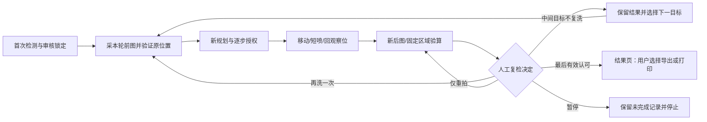

# 工作台复洗与位置管理验收：2026-10-10

本轮已按用户最新明确授权实施；本轮“不需要再确认”只覆盖这次范围。本地 `fzh-branch@23bf6ea173885401c375c51b6865bbc7de7ffb5b` 加本轮未提交改动；只读 GitHub API 核对远端为 `19a2a73bd3817ab8b8aa7b6711a9da3acf3c30fe`。没有拉取、合并、提交或推送。

## 1. 交付和流程

五页增量升级：封面、实时检测、目标审核、清洗监控、独立结果报告。监控并列首次图/实时图、高亮正在处理的 S 编号，中文阶段/动作日志、动画进度、XY 可信位置、校准约束下的喷头预计图，内嵌前后放大/掩膜重合验算。

工作台复洗无业务次数上限；旧非工作台 CLI 的有界回归模式保留。下一轮采当前残留、新规划、新动作编号及授权，不重放喷水。最后目标不具备可信同位置证据时不能通过人工理由放行；此前残留不被最终导航抹除。

## 2. 最重要的计算与可信条件

固定首次 ROI/原图坐标、冻结分割参数；测量域排除已知邻居，必要时全图仅作二次确认。验证首次参考→本轮前图和前图→后图的背景对应，不对图像做位移补偿来伪造复位。每轮报告保留完整参数和哈希。

本轮率=(A前−A后)/A前；累计率相对首次面积；IoU=交集/并集、Dice=2交集/(A前+A后)。负值保留。前景为空按用户要求显示0%且无效，不得自动宣称完全洗净。位置/画质不可信时有效率为空。末块后图空而背景可信，可人工结合实际图像、填写理由认可，报告保留原数值并标明人工来源。

“前后位置完全相同”和“喷头中心精确”不能由软件界面保证。当前 0.25 px 为默认工程判据而非物理零误差；低纹理/偏移/重复帧/光照失焦变化等必须拒绝。实测范围、定位重复性、喷头中心和清洁标准仍由 B/H1/H2/机械完成验证。现有 0.80 是回放阈值，不宣称是实物洁净标准。

## 3. 位置生命周期与入口隔离

在首个 MOVEXY 字节前持久化 MOVING/PENDING，完整回执后提交；部分回执、异常或重启未完成记录变不可信。UI READXY 推算本段带符号位置及预计终点，去程/回程不会重复累加。真实新任务要求重新建立人工参考。没有新增自动回零、限位开关或编码器，没有恢复用户此前移除的软边界。

正式工作台和三个维护工具共享 COM/账本进程锁。维护短距逐次确认，发令前作废正式位置；原自动喷水、达到迭代上限假成功和混合换行串口入口被阻止。旧单帧运动具有 pending 生命周期，但不应与其它控制程序混用；尚不能宣称任何外部串口软件都受本项目锁控制。

## 4. 验收证据与反复检查

最终全量 490 项，111.520 秒，失败/错误/跳过均为 0；此前全量 483 项也通过。 Python 3.13.14，项目 `.venv`。最终日志在 `D:/大创/tmp/mcv_impl_20261010/final_results.txt`，机器可读结果 `final_results.json`，控制台 `final_stdout.txt`。

早期工作区中文临时目录全量运行暴露旧测试直接使用 OpenCV 路径的兼容问题；英文临时目录复跑全部通过。正式单帧图片写入及标定保存已使用字节编码方式支持中文目录。其余历史测试夹具的路径局限未被隐瞒成业务逻辑失败。

| 对抗场景 | 验证结果 |
|---|---|
| 旧 max_cycles=1 / retries=0，人工额外复洗12次 | 同一S0001完成13轮；13个新前帧/动作，报告13行 |
| 复检选择仅重拍 | 不增加PUMP，保存独立recheck_001/002 |
| 普通动作拒绝、旧回复、重复点击、取消后答复、非法字符串 | 不变成物理动作许可，不重放喷水 |
| 后前景为空 | 原始率0、无效；不能自动合格，符合条件时只可有理由人工认可 |
| 前后移动3px、弱纹理、重复像素、画质异常、邻居变化 | 拒绝可信率/末块放行；必要时二次确认 |
| 同一目标再次规划、残留分裂、冻结阈值/核/算法分支 | 新图规划、稳定ID、全ROI面积；不能自适应阈值伪造变化 |
| 完整Tk实际控件流 | 五页、审核锁定、复洗→重拍→下一个→末块认可，mainloop心跳持续 |
| 未通过最后结果 / 导出线程忙闲变化 | 不自动跳报告，不错误解锁打印 |
| 缺标定、位置未知 | 喷头图不宣称正常对齐 |
| 发令前磁盘失败、中断重启、计数不足、锁竞争 | 不发送未登记运动或不继续普通动作；保留未知状态 |
| 任一中间轮次图片/ROI篡改、轮次1000、路径逃逸 | 读档发现问题；按数字排序、不只校验最后一次 |
| 短命令换行注入、旧偏移/喷水、维护取消 | 打开串口前拒绝；取消不作废未运动位置 |

三名子任务分别负责ROI测量、位置生命周期、报告/页面审查；主任务整合状态机，并用新回归检查接口交叉处。独立审查发现并修复了自适应阈值漂移、仅最后轮次报告、打印许可重新启用、旧帧串图和串口换行绕过等问题。真实原生窗口封面已目视检查，其余完整页面流用真实Tk控件/主事件循环反复测试；没有启用非授权的桌面截图替代工具。

可复查的固定合成任务：`output/workbench_qa/rewash_20261010_601fb173/`。3候选、2执行、3次清洗、4次复检；S0001两次清洗且第二次有两次复检，S0003排除。原任务结束没有reports；验收脚本显式导出后产生 `output/workbench_qa/rewash_20261010_601fb173/reports/report_20261010_192655_4493ae79/`。最终流程SUCCESS、报告FAIL、report_ready=True，说明最后人工认可允许查看报告，同时先前残留仍被保留。CSV每次复检一行，共4行。索引 `output/workbench_qa/rewash_validation_20261010.json` 保存源码哈希与数据。

本机输出与测试日志被Git忽略，不是其它电脑自动拥有的实验包。报告HTML/CSV结构和资产经过测试；此前浏览器本地文件预览被策略阻止，本轮没有换浏览器/协议绕过；浏览器分页、物理打印和PDF保存仍未验证。

## 5. 同步与剩余现场交接

已同步六份项目记忆、README、两级AGENTS、project_state、工作台手册、总流程/联调差距、硬件入口/协议、进度/提交核对/续做记录和最初方案。旧记录按日期保留，本轮规范置顶。私有记忆只追加小型交接注记，未重写注册表。

成员A/B/C与H1/H2手册、接口/分工/术语和长期规划也已加入当前交接；165个文档链接检查均可定位，历史缺失接线照片改为缺失来源说明。固定验收报告4条复检CSV行和38个图片引用均完整，档案读取无证据问题。检查记录在 `D:/大创/tmp/mcv_impl_20261010/delivery_checks.json`。

本轮使用合成图、协议串口替身及真实 Tk 控件，证据等级 E2。未连接真实相机或 COM，未操作电机、水泵、固件或打印机；没有获得实物零偏移、喷头精度或清洁效果验收。

下一次实物验收：B提供人工真值和配准/冻结分割失败集；A归档同任务成像设置与原图；H2独立测位移/回程误差/喷头中心偏移；H1核对同次固件PB12急停及短喷/STOP；机械确认固定参考和实际行程；C用这些证据运行单目标无泵验收，再经现场授权短喷。细节与启动命令见[操作手册](可视化工作台操作手册.md)。
